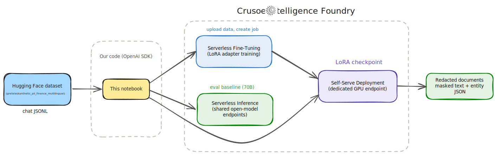

# Fine-Tune a PII Redaction Engine with Crusoe Serverless Fine-Tuning

An end-to-end walkthrough of [Crusoe Serverless Fine-Tuning](https://docs.crusoecloud.com/serverless-fine-tuning/overview) and [Self-Serve Deployments](https://docs.crusoecloud.com/self-serve-deployments/overview): fine-tune [Qwen3 8B](https://huggingface.co/Qwen/Qwen3-8B) to find and mask personally identifiable information in financial documents, deploy it as a dedicated endpoint, and evaluate it against a general-purpose 70B model. 

The recipe is model agnostic, you can swap the base model with any other [supported model](https://www.crusoe.ai/cloud/serverless-fine-tuning) in the fine-tuning registry and everything else stays the same.

PII redaction is exactly the workload you cannot send to a third-party model API, because the input is the sensitive data itself. Fine-tuning and serving the model inside your own cloud environment is the point, not an implementation detail.



## Quickstart

```bash
cp .env.example .env   # then fill in CRUSOE_API_KEY
uv venv && uv pip install -r requirements.txt
```

The notebook walks you through the rest, covering:

1. **Prepare the data**: download a synthetic PII dataset from Hugging Face, convert it to chat-format JSONL, and validate it before upload
2. **Fine-tune**: launch a LoRA job on Serverless Fine-Tuning and watch the live loss curves
3. **Deploy**: turn the best checkpoint into a dedicated endpoint with a few clicks in the Crusoe Console
4. **Run inference**: redact documents through the OpenAI-compatible API, with and without streaming
5. **Evaluate**: score the fine-tuned model against a general-purpose 70B baseline on entity-level F1

## Links

- Launch blog: [Crusoe Introduces Serverless Fine-Tuning](https://www.crusoe.ai/resources/blog/crusoe-introduces-serverless-fine-tuning)
- Launch blog: [Crusoe Self-Serve Deployments](https://www.crusoe.ai/resources/blog/crusoe-self-serve-deployments)
- [Serverless Fine-Tuning documentation](https://docs.crusoecloud.com/serverless-fine-tuning/overview)
- [Self-Serve Deployments documentation](https://docs.crusoecloud.com/self-serve-deployments/overview)
- [Fine-tuning API reference](https://docs.crusoecloud.com/api/managed-ai/#tag/Fine-tuning)
- Model: [Qwen/Qwen3-8B](https://huggingface.co/Qwen/Qwen3-8B)
